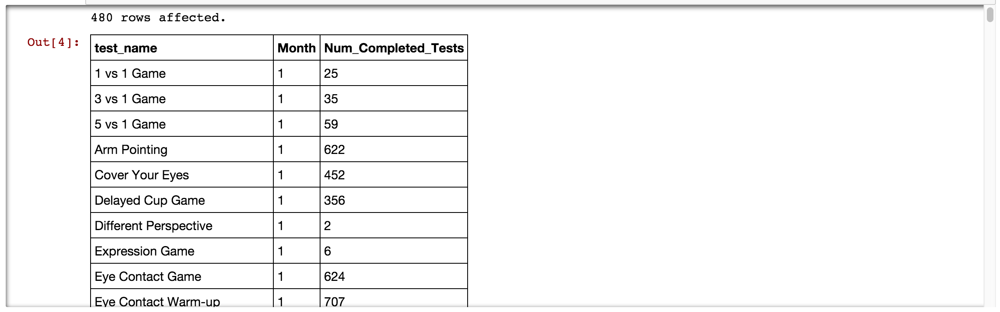

# programming

## Overall Description

This is one of the continuously updated repositories that documents personal data science journey. Currently, contents are organized into three different repositories based on the following table's description.

| Repository | Documentation Focus |
| ---------- | ----------- |
| [machine-learning](https://github.com/ethen8181/machine-learning) | Machine learning in R / python. |
| [Business-Analytics](https://github.com/ethen8181/Business-Analytics) | All the other data analytic related stuffs that are not solely about machine-learning. |
| [programming](https://github.com/ethen8181/programming) | Walking through books / online courses. |

## Python Machine Learning

2016.3.20 | Walking through the book [python machine learning](https://github.com/rasbt/python-machine-learning-book).

**Chapter 2 : Training Machine Learning Algorithms for Classification** 

- Coding up perceptron, batch / stochastic gradient descent.
- View [[nbviewer](http://nbviewer.jupyter.org/github/ethen8181/programming/blob/master/python_machine_learning/chapter2/chapter2.ipynb)]

**Chapter 3 : A Tour of Machine Learning Classifiers Using Scikit-Learn** 

- Using some of Scikit-Learn’s classification algorithm, including logistic regression, svm, decision tree, knn.
- View [[nbviewer](http://nbviewer.jupyter.org/github/ethen8181/programming/blob/master/python_machine_learning/chapter3/chapter3.ipynb)]

**Chapter 4 : Building Good Training Sets – Data Pre-Processing** 

- Preprocessing. Filling in missing values and LabelCoding categorical variable.
- Coding up sequential backward selection.
- Accessing randomforest variable importance.
- View [[nbviewer](http://nbviewer.jupyter.org/github/ethen8181/programming/blob/master/python_machine_learning/chapter4/chapter4.ipynb)]

**Chapter 5: Compressing Data via Dimensionality Reduction** ( TODO : lda, kernel )

- Principal Component Analysis. Matching implementation from scratch and Scikit-Learn.
- View [[nbviewer](http://nbviewer.jupyter.org/github/ethen8181/programming/blob/master/python_machine_learning/chapter5/chapter5.ipynb)]

**Chapter 6 : Learning Best Practices for Model Evaluation and Hyperparameter Optimization** 

- Scikit-Learn’s Pipeline, Learning and Validation Curve.
- K-Fold, Grid Search and ROC curve.
- View [[nbviewer](http://nbviewer.jupyter.org/github/ethen8181/programming/blob/master/python_machine_learning/chapter6/chapter6.ipynb)]

**Chapter 7 : Combining Different Models for Ensemble Learning**

- Coding up majority voting, using Scikit-Learn’s version and combining it with Grid Search.
- View[[nbviewer](http://nbviewer.jupyter.org/github/ethen8181/programming/blob/master/python_machine_learning/chapter7/chapter7.ipynb)]

## Programming

- 2016.3.02 | @property, python's way of getters and setters. [[nbviewer](http://nbviewer.jupyter.org/github/ethen8181/programming/blob/master/programming/class_@property.ipynb)]
- 2016.2.22 | @classmethod (alternative constructor) and @staticmethod (adding functions under class). [[nbviewer](http://nbviewer.jupyter.org/github/ethen8181/programming/blob/master/programming/class.ipynb)]
- 2016.2.22 | sorting with itemgetter and attrgetter. [[nbviewer](http://nbviewer.jupyter.org/github/ethen8181/programming/blob/master/programming/sorting_with_itemgetter.ipynb)]
- 2016.2.19 | tricks with list and dictionaries; for .. else .. statement; decorators. [[nbviewer](http://nbviewer.jupyter.org/github/ethen8181/programming/blob/master/programming/idiomatic_python.ipynb)] 
- 2016.2.18 | namedtuple and defaultdict. [[nbviewer](http://nbviewer.jupyter.org/github/ethen8181/programming/blob/master/programming/collections_module.ipynb)]

## Linux Command Lines

- Basic nagivations. [[R markdown](http://ethen8181.github.io/programming/linux_commands/linux_commands.html)]
- Customizing terminal. [[Youtube](https://www.youtube.com/watch?v=vDOVEDl2z84)]

## Managing Big Data with MySQL

2016.2.18 | Walking through the Coursera course [Managing Big Data with MySQL](https://www.coursera.org/learn/analytics-mysql). 

Important things to note!!!!! 

1. The results are not reproducible as all the notebooks were connected to the MySQL server provided during course. Currently, the database's data, including six separate tables are being stored separately as csv files in the [dognition data folder](https://github.com/ethen8181/programming/tree/master/database/mysql_exercise/dognition_data).

2. If you wish to view to documentations, downloading the whole folder and viewing them on your local ipython notebook is strongly recommended, since all the documentations may be not that visually appealing when viewing it directly on the web. To explain what I mean, consider the screenshot below. Even though the output consists of 480 rows in total, instead of printing out the whole thing, the local ipython notebook will only display the first few rows and provide a scroller for you to scroll down. And if you were to view it on the web all the rows will be printed out.

 - Looking at your data. [[nbviewer](http://nbviewer.jupyter.org/github/ethen8181/programming/blob/master/database/mysql_exercise/MySQL_Exercise_01_Looking_at_Your_Data.ipynb)]
- Selecting data subsets using WHERE. [[nbviewer](http://nbviewer.jupyter.org/github/ethen8181/programming/blob/master/database/mysql_exercise/MySQL_Exercise_02_Selecting_Data_Subsets_using_WHERE.ipynb)]
- Formatting selected data ( AS, DISTINCT, exporting data to csv file ). [[nbviewer](http://nbviewer.jupyter.org/github/ethen8181/programming/blob/master/database/mysql_exercise/MySQL_Exercise_03_Formatting_Selected_Data.ipynb)]
- Summarizing your data. [[nbviewer](http://nbviewer.jupyter.org/github/ethen8181/programming/blob/master/database/mysql_exercise/MySQL_Exercise_04_Summarizing_Your_Data.ipynb)]
- Summarizing your data by groups. [[nbviewer](http://nbviewer.jupyter.org/github/ethen8181/programming/blob/master/database/mysql_exercise/MySQL_Exercise_05_Summaries_of_Groups_of_Data.ipynb)]
- Common pitfalls of grouped queries. [[nbviewer](http://nbviewer.jupyter.org/github/ethen8181/programming/blob/master/database/mysql_exercise/MySQL_Exercise_06_Common_Pitfalls_of_Grouped_Queries.ipynb)]
- Inner Joins. [[nbviewer](http://nbviewer.jupyter.org/github/ethen8181/programming/blob/master/database/mysql_exercise/MySQL_Exercise_07_Inner_Joins.ipynb)]
- Outer Joins. [[nbviewer](http://nbviewer.jupyter.org/github/ethen8181/programming/blob/master/database/mysql_exercise/MySQL_Exercise_08_Joining_Tables_with_Outer_Joins.ipynb)]
- Subqueries and derived tables. [[nbviewer](http://nbviewer.jupyter.org/github/ethen8181/programming/blob/master/database/mysql_exercise/MySQL_Exercise_09_Subqueries_and_Derived_Tables.ipynb)]
- Useful logical functions ( IF, CASE ). [[nbviewer](http://nbviewer.jupyter.org/github/ethen8181/programming/blob/master/database/mysql_exercise/MySQL_Exercise_10_Useful_Logical_Functions.ipynb)]
- Working on the dataset part 1. [[nbviewer](http://nbviewer.jupyter.org/github/ethen8181/programming/blob/master/database/mysql_exercise/MySQL_Exercise_11_Queries_that_Test_Relationships_Between_Test_Completion_and_Dog_Characterisitcs.ipynb)]
- Working on the dataset part 2. [[nbviewer](http://nbviewer.jupyter.org/github/ethen8181/programming/blob/master/database/mysql_exercise/MySQL_Exercise_12_Queries_that_Test_Relationships_Between_Test_Completion_and_Test_Circumstances.ipynb)]

