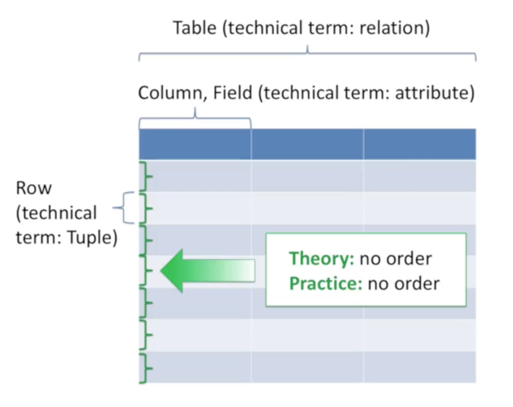

Relational Database is based on set series. For relational databases to work most efficiently, the following requirements of set theory should be followed :

1. Each row in a table should represent a unique instance of the information in that table.
2. Single tables should represent the smallest logical parts of a data set.
3. Each column in a table should represent a unique category of information.

The type of information that are most likely to be stored in a relational database as opposed to another type of database are metadata (file name, file location, when the file was created, etc.) about pictures.

## Entity-Relationship ( ER ) Diagrams

Terms :

- **Entity :** Rectangular boxes. They represent categories of data your database keeps track of. They'll essentially become a table once your database is set up.
- **Entity Instance :** A single occurrence of an entity type. In a table it would look it : a row
- **Attributes :** Ovals. They represent unique measurement under each category. They'll most likely become the column of each table. You indicate unique key by underlining them
- **Unique Key :** An attribute with unique value in each entity instance. This allows you to link tables together.

Every entity or category has to be related to at least one other entity in the database. Use a diamond to describe the relationships and the word in the diamond describes the nature of the relationship. 

- **Cardinality Symbols :** Represents limitations between entities or categories. Sits next to the symbols besides the ER diagram. The way of reading this is that the symbol closest to the rectangular boxes represents the maximum number of instances of the entity that can be associated with another entity and the symbol farthest away from the rectangle represents the minimum number of instances.
    - A straight line. Means 1.
    - A birdfoot. Means more than 1.
    - M. Means infinite.
    - O. A circle means optional
    - But the relationships can also be represented as numbers inside a parenthesis, these numbers takes precedence over the symbols. The numbers are always read from left to right so left represents the minimum and right represents the maximum.

## Relational Schemas



The graph above shows that : 

- Tables can be referred to as Relations.
- Columns can be referred to as Fields or Attributes.
- Rows can be referred to as a Tuple.
- Columns and Rows should both not have a specific order.

Composes of "Table", "Primary Key", "Foreign Key".

- **Primary Key :** Column whose value is unique for every row in a table. The primary key will be underlined in a ER diagram. Although you are suppose to underline all unique attributes in the ER diagram in the schema or relation, only one unique column in a table or relational schema can be labled as a primary key. The only exception is if you need multiple columns to make each row in a table unique. The reason for this is that the database software uses the primary key in a special way to ensure data integrity, which means the primary keys can not have missing values. Unique columns ( marked by U in the schema ) that are not primary keys can also be used to link between tables. When multiple columns serves as the primary key then it is called a composite primary key.

- **Foreign Key :** Foreign keys are used to link tables to other tables. They accomplish this by having values that refer to columns with unique values for every row in other relations / tables. You indicate foreign keys ( marked by FK in the schema ) in relational schemas by drawing arrows from the foreign key in one table to the primary / unique key it refers to in another table. Note that foreign keys and the primary / unique key does not have to use the same title. 

## SQL Syntax

SQL syntax or the data querying part sounds like you're speaking an abbreviated form of English.

```
SELECT ( the data you want )
FROM ( the database and table you want )
WHERE ( the following criteria are met )
GROUP BY ( this field )
HAVING ( this property, then )
ORDER BY ( this field or list )
```

It's also a good habit of ending your query with a semicolon (;).


