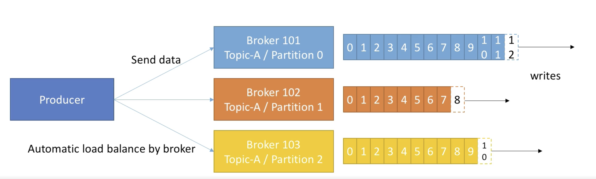
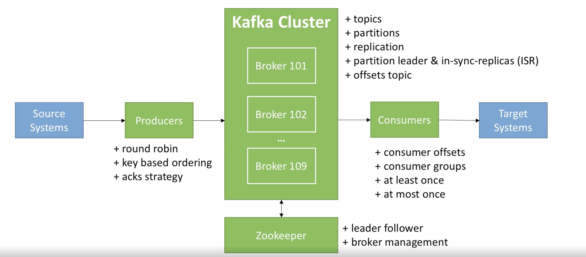
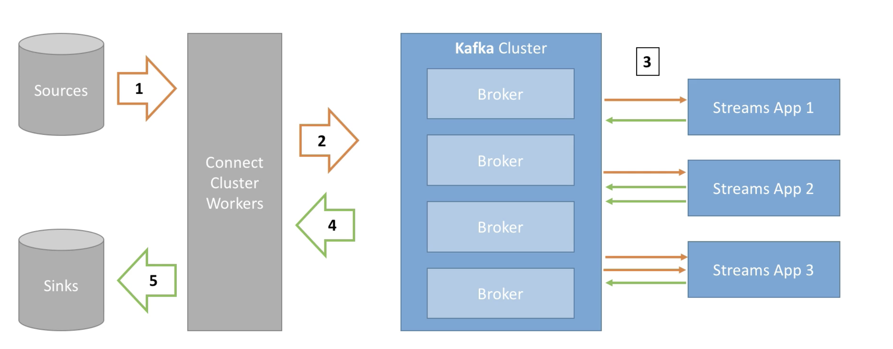

# Apache Kafka

https://github.com/simplesteph/kafka-beginners-course

The problems that organizations are facing with the previous architecture is that if we have x many source systems and y many target systems we would have to write x times y many integrations.

Each integration comes with difficulties around:

- Protocol: how the data is transported (REST, JDBC, etc)
- Data Format - how the data is parsed (Binary, cvs, json, avro, etc)
- Data Schema - how the data is shaped and evolved

And with additional connection, it will increase the source system's load. The why of Apache Kafka is now we will have our source system write to Apache Kafka and our target system will also read from Apache Kafka, thus unifying the data flow.

Apache Kafka is often denoted as a high throughput distributed messaging system. The benefit that it brings are:

 - resilient architecture, fault tolerant
 - horizontal scalability (millions of messages per sec)
 - real time (latency of less than 10 ms)

The primary use case of Kafka is it serves as a "speed layer" for real time applications, while having a "slow layer" which helps with data ingestion into stores for later analytics.

Use Cases:

- Netflix uses it to generate recommendations in real time while we're watching TV showes.
- Uber uses it to gather user, taxi, trip data in real time to compute and forecast demand, then leverage that info to compute surge pricing in real time.
- Linkedin uses kafka to prevent spam, collect user interactions to make better connection recommendations in real time.

## Apache Kafka Theory

**Topic:** base of everything, presenting a particular stream of data. Similar to a table in a database (without all the constraints), we can have as many topic as we want and a topic is identified by its name.

Topics are split into partitions (we need to specify the number). Each message within a partition gets an incremental id, called **offset**, the offset will keep increasing as it receives new messages. Each partition is independent of each other and therefore can have different number of messages. Hence offset only have meaning in the context of a specific topic and partition and order is only guaranteed within a partition, not across.

- Once the data is written to a partition, it can't be changed (immutability)
- Data is only kept for a limited time (default is 1 week).
- Data is assigned randomly to a partition unless a key is provided.

Example:

Say we have a fleet of trucks, each truck will report its GPS position to a single Kafka topic `trucks_gps` every 20 seconds. The message contains the truck id and the truck position.

The consumer of this topic can then use it for location dashboard to know the position of these trucks, or use it for notification service (e.g. if the driver has been driving too long, warn them to take a break)


**Brokers**

A kafka cluster is composed of multiple brokers (servers).

Each broker is identified with its ID and contains certain topic partitions. When we create a topic with n number of partitions, each partition amongst that topic will be distributed across all the brokers.

After connecting to any broker, we will be connected to the entire cluster. Every Kafka broker is also called a bootstrap server, as each broker contains metadata about all the broker, topic and partition.

Note that there's also the notion of topic replication, so that if a broker goes down, the other broker can step up and serve the data. This replication is very common in the big data world as machines can go down unexpectedly or taken down for maintenance.

Another concept is leader for a partition. Underneath the hood, zookeeper will choose one and only one leader for a given partition. Only the leader can receive and serve data for that partition, the other broker will only be used to synchronize the data (these other partitions are what kafka calls in-sync replica). When the leader goes down, zookeeper will "elect" a new one.


**Producers**

Producer write data to topics and it automatically know which broker and partition to write to. The load will be balanced to many brokers.

There are different modes of sending the data. Producer can choose whether to receive acknowledgement of data writes. i.e. the producer doesn't know whether the broker is down or not unless it requests for this metadata. Different options are tradeoff between latency and safety.

- `acks=0`: no acknowledgement at all (possible data loss). As no response is requested it's useful when it's okay to lose message (e.g. metrics collection, log collection).
- `acks=1`: producer will wait for leader acknowledgement (limited data loss). The leader broker will respond with every write request, but the replication is not a guarantee. What can happen is the leader broker goes offline, but the replicas haven't replicated the data yet, resulting in a data loss.
- `acks=all`: leader + replicas acknowledgement (no data loss)

Message key. Producer can choose to send a key with the message. If the key is sent, then we get the guarantee that all messages for that key will always go to the same partition. This is used if we need message ordering for a specific field. e.g. back to our truck fleet example, truck_id_123's message will always be in say partition 0.

As long as the number of partitions remains constant for a topic, the same key will always go to the same partition. The formula looks something like the following:

targetPartition = abs(murmur2(record.key())) % numPartitions





**Consumers**

Consumer read data from a topic and it knows which broker to read from. Data is read in order within each partitions.

We can think of consumer groups as our application. e.g. we can have a java app that have multiple consumers consuming data from the topic/partition that we are interested in. **Note that if we have more consumers than partitions, then some consumers will be inactive**. Hence it is important to configure the appropriate partition number to ensure we can consume the data during peak throughput.

Kafka consumers have a "poll" model, where a given consumer would "poll" data from the broker along with a a given timeout value. Then the broker would return the data immediately if possible, or return empty after timeout. The "poll" model gives the consumer to control how fast to consume the message and the ability to replay events.

**Consumer offsets**. When a consumer in a group has processed data received from kafka, it will commit the offsets in a Kafka topic named `__consumer_offsets`, that way if a consumer dies, it will be able to read back from where it left off. This behaviour is closely related to **delivery semantics for consumers**.

Consumer can choose when to commit offsets:

- `At most once`. Offsets are committed as soon as message is received. If the processing goes wrong, the message will be lost (it won't be read again).
- `At least once` (usually preferred). Offsets are committed after the message is processed.  If the processing goes wrong, the message will be read again. This can result in duplicate processing of messages.
- `Exactly once`. This can be achieved for Kafka to Kafka workflows using Kafka Stream API. Or for Kafka to external system workflows, we should use an idempotent consumer.
- The bottom line is for most applications, we should use at least once processing and ensure our consumers are idempotent (supply a primary id to make sure no records with the same id are inserted twice).


**Zookeeper**

Zookeeper help manages brokers, perform leader election for partitions, sends notification to Kafka in case of changes (e.g. a topic is created/deleted, broker dies or comes back up, etc.)

Zookeeper by design operates with an odd number of servers as it has the concept of leaders that handles writes and the rest of the servers are followers that handle reads.





# Setup

- https://kafka.apache.org/downloads
- https://kafka.apache.org/quickstart

```bash
mv Downloads/kafka_2.12-2.2.1.tgz .
tar -xzf kafka_2.12-2.2.1.tgz
cd kafka_2.12-2.2.1

# start a zookeeper server
bin/zookeeper-server-start.sh config/zookeeper.properties

# we need another terminal window to start kafka server
bin/kafka-server-start.sh config/server.properties
```

Create a Kafka topic.

```bash
bash bin/kafka-topics.sh \
--bootstrap-server localhost:9092 \
--topic first_topic \
--partitions 3 \
--replication-factor 1 \
--create

# after creation, we can ask kafka to list all the available topics
bin/kafka-topics.sh --list --bootstrap-server localhost:9092

# describe the topic
# we'll get to see information such as partition count, replication factor,
# which broker is the leader and which machines are replicas for a particular partition
bin/kafka-topics.sh --topic first_topic --describe --bootstrap-server localhost:9092
```

Some general guidelines, your mileage may vary.

In production, when choosing the number of partitions setting it to 1 or 2x the # of brokers is usually a good starting point. As for replication factor, 3 is usually the golden standard, we should also ensure that our Kafka cluster has at least 3 brokers.

Another rule of thumb is that a broker shouldn't hold more than 2000 to 4000 partitions, and a Kafka cluster shouldn't have more than 20,000 partitions across all brokers. If we are to go beyond that limit, consider creating another Kafka cluster.

Producer & Consumer

```bash
# producer
bin/kafka-console-producer.sh --broker-list localhost:9092 --topic first_topic

# consumer
bin/kafka-console-consumer.sh --bootstrap-server localhost:9092 --topic first_topic --from-beginning
```

we can launch the consumer and producer at separate terminal window, the producer will prompt us for messages and we can see that message getting consumed by the consumer.


Consumer Groups

```bash
bin/kafka-console-consumer.sh \
--bootstrap-server localhost:9092 \
--topic first_topic \
--group my-first-application
```

After assigning the group, we no longer need the `--from-beginning` flag as the consumer group will use the consumer offset to keep track of which message this consumer group needs to consume. We can use the `--reset-offsets` flag to refresh the offset for a specific group & topic.

```bash
bin/kafka-consumer-groups.sh \
--bootstrap-server localhost:9092 \
--group my-first-application \
--reset-offsets \
--to-earliest \
--execute \
--topic first_topic
```

If we launch multiple of the same consumer group, we will see our messages being consumed by different of the same consumer group.

```bash
# after creating the consumer group, we can list all the ones that are created
bin/kafka-consumer-groups.sh --bootstrap-server localhost:9092 --list

# cherry pick one and get more detailed information
# we'll see information such as the current offset and lag for each topic's partition
bin/kafka-consumer-groups.sh \
--bootstrap-server localhost:9092 \
--group my-first-application \
--describe
```


## Advanced Configs

**Safe Producer** 

No data loss, ensures no duplicated messages being sent, ensure ordering within a partition.

- `enable.idempotence=true` (producer level). This implies that:
  - `ack=all` (producer level), which ensures the data is properly replicated before an ack is received.
  - `retries=MAX_INT` (producer level), ensures transient errors are retried indefinitely.
  - `max.in.flight.requests.per.connection=5` (producer level). Multiple request is tried at a time to increase throughout, ordering is still guaranteed with a idempotent producer.
- `min.insync.replicas=2` (broker/topic level). Ensures two brokers have the data after an ack. This config goes hand in hand with `ack=all`. e.g. if `replication.factor=3`, then that means we can only tolerate 1 broker going down, otherwise the producer will receive a not enough replicas exception on send.

**Message Compression**

Producer usually sends data that is text-based, in this case it's important to apply compression as it decreases the data size being send over the network (better throughout) and disk space. Compression is more effective when the batch of message being sent to Kafka is bigger.

The disadvantage is that producers/consumers must commit some CPU cycles to compression/decompression (but usually very minor).

https://blog.cloudflare.com/squeezing-the-firehose/

**Message Batching**

- `batch.size` maximum number of bytes that will be included in the batch. Default is 16kb.
- `linger.ms` number of milliseconds a producer is willing to wait before sending a batch out.

Kafka defaults to sending the message as soon as possible. By introducing some lag (e.g. 5ms) and increasing the batch size (e.g. 32kb, 64kb), we increase the chances of messages being sent together in a batch. This in turn can help increase the compression/throughout and efficiency of requests.

Any messages that is bigger than the batch size will not be batched. Also note that a batch is allocated per partition, so make sure we don't set it to a number that is too high to prevent memory issues.

**Consumer Polling**

- `max.poll.records` (default 500). Controls how many records to receive per poll request. Monitor how many records we're polling, and consider increasing if we're always hitting the 500 bar. Could happen because our messages are typically very small and we could tweak the setting if we have a lot of RAM available.

**Consumer Offset**

- `auto.offset.reset=[latest/earliest]` Kafka has a data retention policy of 7 days. Hence if our consumer is down for more than 7 days, the offsets are "invalid" and we will miss data. We can then use this config to either read from the start/end of the log.
- `offset.retention.minutes`. Consumer's offsets can be lost if it hasn't read new data in 7 days, we can control this broker setting to set a proper retention period.

In case of unexpected behaviour, we can replay data for a consumer group.

- Take all the consumers from a specific group down.
- Use kafka-consumer-groups command to set offset to what we want.
- Restart consumers.

**Consumer Poll Thread**

Mechanism for detecting a consumer application being down or issues with data processing.

- `max.poll.interval.ms` (default 5 minutes). max amount of time between two .poll call before declaring the consumer dead. This is particularly relevant if we're using big data framework like Spark to perform processing.
- `session.timeout.ms` (default 10 seconds) Heartbeaks are sent periodically to the broker. If no heartbeat is sent during that period then the consumer will be considered dead and will trigger a consumer rebalance.
- `heartbeat.interval.ms` (default 3 seconds). How frequent to send the heartbeats, usually set to 1/3 of `session.timeout.ms`.


# Kafka Ecosystem

**Kafka Connect** is all about code and connectors re-use. This allows to simplify the process of getting data in and out of Kafka, i.e. other people have already wrote the boilerplate code of getting data from twitter or consuming the data and storing it in Elasticsearch, we can re-use that code. Source Connectors to get data from common data sources and a Sink Connectors to publish that data into common data stores.

**Kafka Streams** is a data processing and transformation library within Kafka. Given a input topic, we can create a topology to apply various transformations and write the processed messages back to another topic.



**Schema Registry** In real world applications, we need some way of preventing producers from sending bad data or keep up with the constant change in schema. The schema registry store and retrieve schemas for Producer/Consumer, enforces topic compatibility, the usage of avro data format also decrease the payload size.


# Others

## ElasticSearch

We can actually set up an ElasticSearch cluster using https://bonsai.io/, we can go to their website, follow the sign-up page and get a good enough free cluster for demo use-case.

Once we spin up the cluster we can check the access/credential tab for the URI and login credentials.

https://medium.com/capital-one-tech/choosing-between-rest-web-apis-and-message-streaming-8e2f4813a058

> The streaming api is quite different from the REST api because the REST api is used to pull data from twitter but the streaming api pushes messages to a persistent session. This allows the streaming api to download more data in real time than could be done using the REST API.